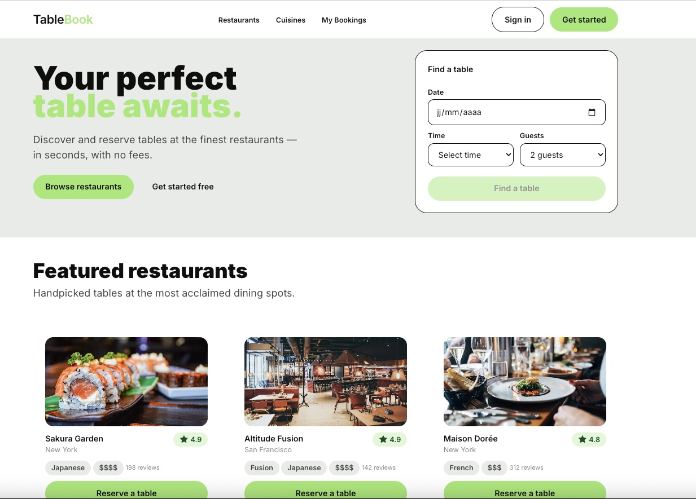
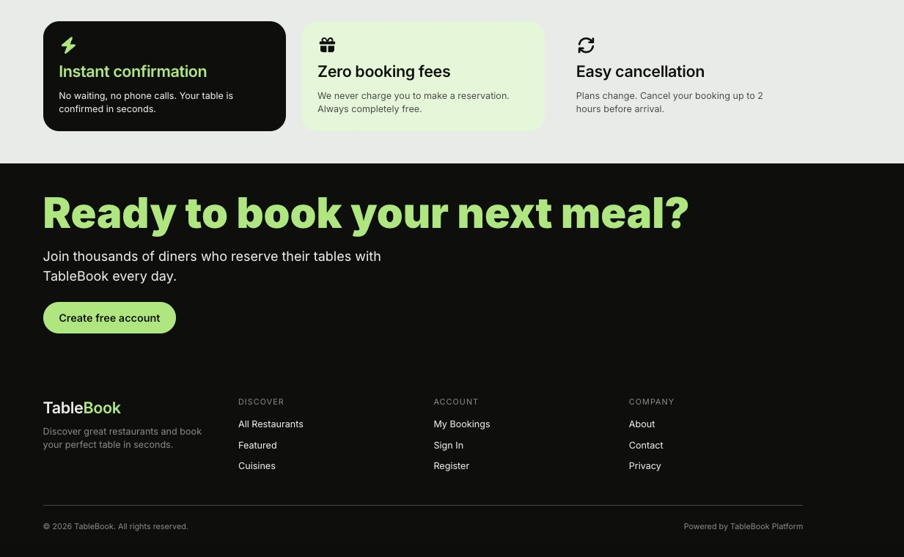
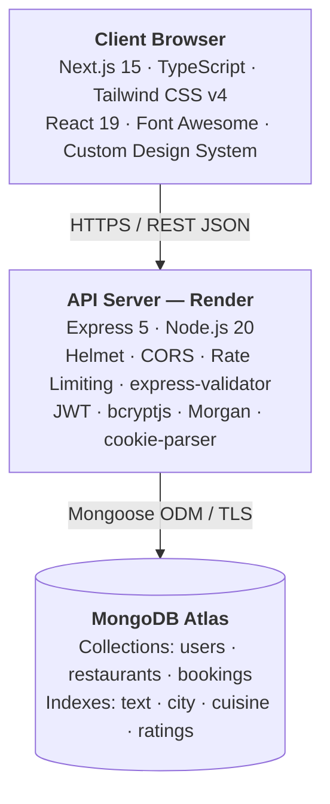
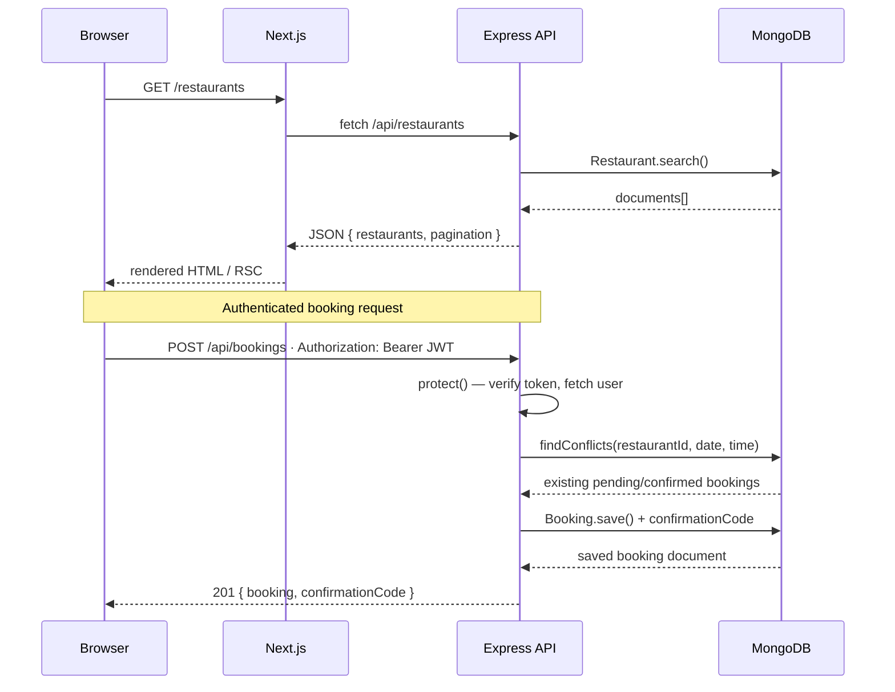
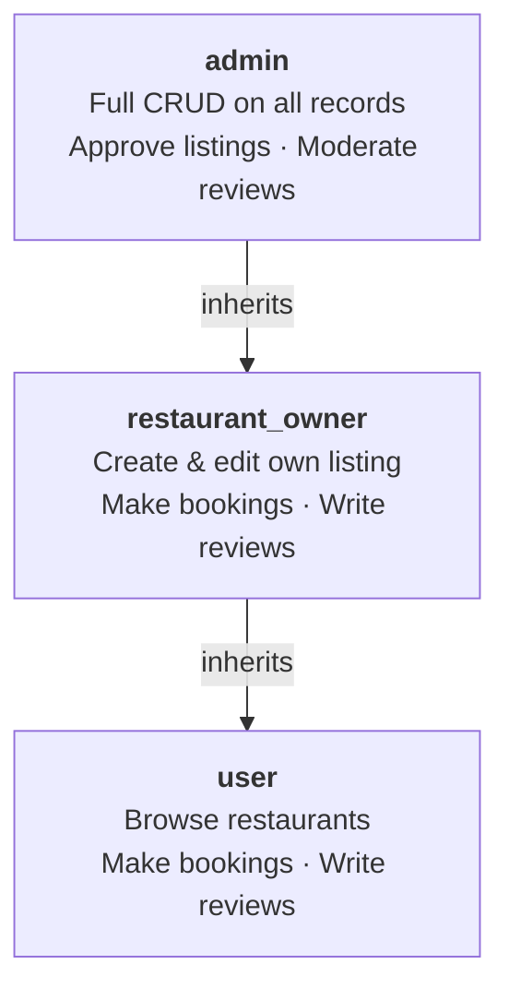
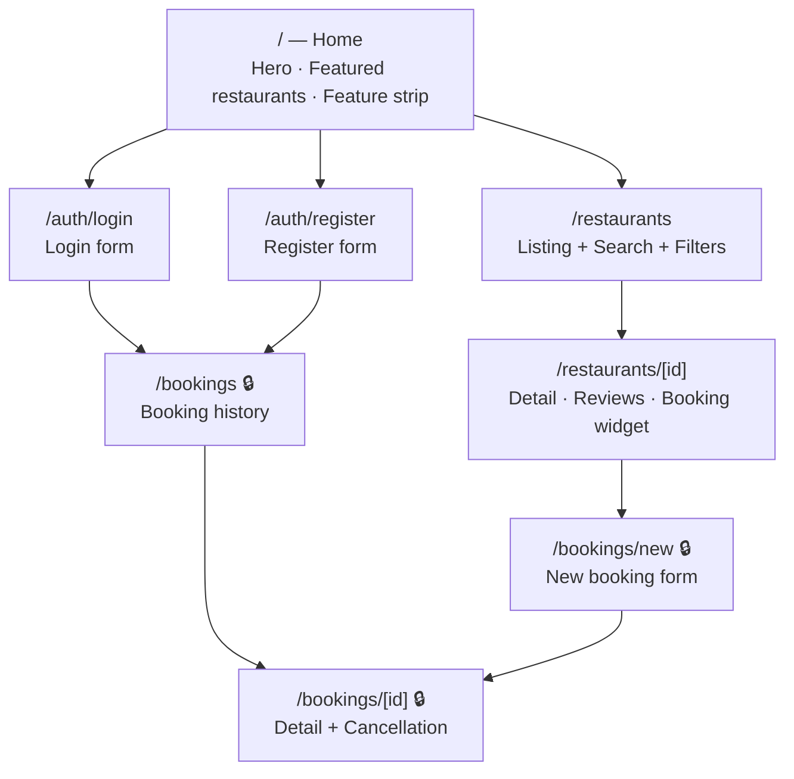
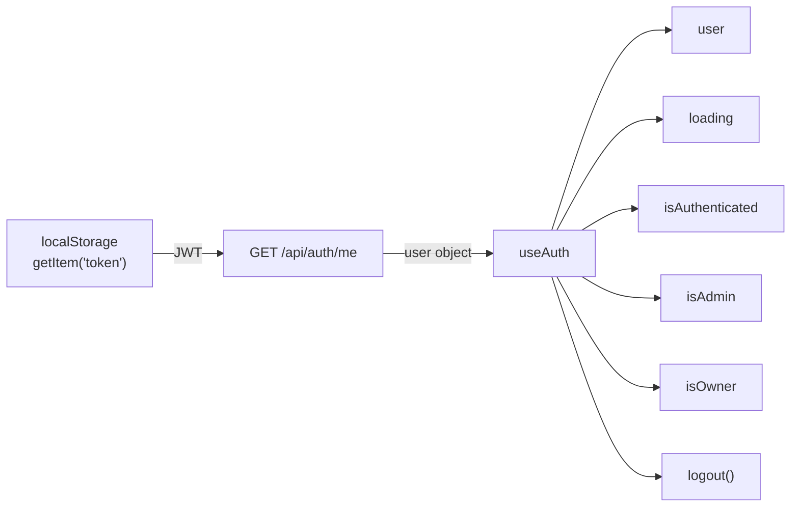
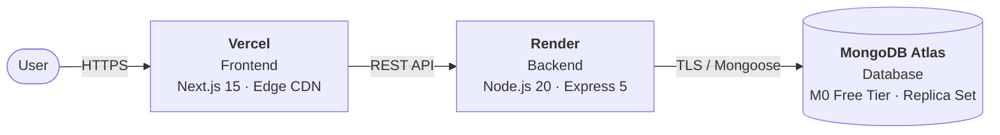

# TableBook — Restaurant Reservation Platform

A full-stack web application that lets diners discover restaurants, read and write reviews, and book tables in real time — with zero booking fees. This document covers system architecture, technology justifications, database design, API specification, security model, cloud deployment, and local development setup.

---

## Table of Contents

1. [Project Overview](#1-project-overview)
2. [System Architecture](#2-system-architecture)
3. [Technology Stack & Justifications](#3-technology-stack--justifications)
4. [Database Design](#4-database-design)
5. [API Reference](#5-api-reference)
6. [Security Design](#6-security-design)
7. [Frontend Architecture](#7-frontend-architecture)
8. [Cloud Deployment](#8-cloud-deployment)
9. [Local Development](#9-local-development)
10. [Environment Variables](#10-environment-variables)

---

## 1. Project Overview

TableBook solves a common pain point: making a restaurant reservation still often requires a phone call, a third-party app that charges a fee, or an uncertain wait for confirmation. TableBook removes all three friction points — discovery, booking, and confirmation happen in a single browser session.

Project Links
- [tablebook-front.vercel.app](tablebook-front.vercel.app)
- [https://github.com/alban-okoby/tablebook-app](https://github.com/alban-okoby/tablebook-app)






### Core User Flows

| User type | Primary actions |
|-----------|-----------------|
| **Guest** | Browse restaurants, read reviews, search by city / cuisine / price |
| **Authenticated user** | All guest actions + book a table, cancel a booking, write a review, view booking history |
| **Restaurant owner** | Create and edit their restaurant listing, manage tables and opening hours |
| **Admin** | Full CRUD on all records, approve/reject listings, moderate reviews |

### Key Features

- Full-text restaurant search with filters (city, cuisine, price range, rating)
- Real-time conflict detection — prevents double-booking the same time slot
- Auto-generated confirmation codes for every booking
- Embedded review system with star ratings recalculated on every write
- JWT-based authentication with role-based access control (user / restaurant\_owner / admin)
- Auth-aware navigation: guests see Sign in / Get started; authenticated users see a personalised avatar menu

---

## 2. System Architecture

### High-Level Diagram



### Request Lifecycle



### Monorepo Structure

```
book-recommendation-app/
├── backend/                  Express API
│   └── src/
│       ├── config/           database.js  ·  seeder.js
│       ├── middleware/        auth.middleware.js
│       ├── models/           User.js  ·  Restaurant.js  ·  Booking.js
│       ├── routes/           auth.js  ·  restaurants.js  ·  bookings.js  ·  users.js
│       ├── utils/            jwt.js
│       └── server.js
└── frontend/                 Next.js application
    └── src/
        ├── app/              App Router pages (auth / bookings / restaurants)
        ├── components/       auth  ·  booking  ·  layout  ·  restaurant  ·  ui  ·  bands
        ├── hooks/            useAuth  ·  useBookings  ·  useRestaurants
        ├── lib/              api.ts  ·  auth-token.ts  ·  tokens.ts
        ├── middleware.ts     Next.js edge middleware (auth-guard)
        └── types/            booking.ts  ·  restaurant.ts  ·  user.ts
```

---

## 3. Technology Stack & Justifications

### Backend

| Technology | Version | Why |
|------------|---------|-----|
| **Node.js** | 20 LTS | Non-blocking I/O handles concurrent reservation requests without threads. LTS guarantees security patches through 2026. |
| **Express 5** | 5.2 | Async error propagation is built-in (no manual `next(err)` wrapping in try/catch). Minimal, un-opinionated — the team controls the architecture. |
| **MongoDB + Mongoose** | 8 | Restaurant data is heterogeneous (different table layouts, opening hours, embedded review arrays). A document store maps directly to this shape. Mongoose adds schema validation, virtuals, and a query DSL without an ORM overhead penalty. |
| **JWT (jsonwebtoken)** | 9 | Stateless authentication scales horizontally without a shared session store. Tokens carry the user ID and role, so every service call is self-contained. |
| **bcryptjs** | 3 | Industry-standard adaptive hashing. Cost factor 12 requires ~300ms per hash on commodity hardware — acceptable at login but impractical to brute-force at scale. |
| **Helmet** | 7 | Sets 14 security-relevant HTTP headers (CSP, HSTS, X-Frame-Options, etc.) in one line. |
| **express-rate-limit** | 7 | Separate limits for API (100 req / 15 min) and auth routes (10 req / 15 min) prevent credential-stuffing attacks without a Redis dependency. |
| **express-validator** | 7 | Declarative schema validation in route handlers keeps controller logic thin and error messages consistent. |

### Frontend

| Technology | Version | Why |
|------------|---------|-----|
| **Next.js 15 (App Router)** | 15.3 | React Server Components ship zero JS for static content. The App Router co-locates layouts, loading states, and error boundaries with their page segment. Middleware-level auth guards protect routes at the edge before any page renders. |
| **TypeScript** | 5 | Shared `types/` folder makes API response shapes explicit across components, hooks, and fetch utilities — catching mismatches at compile time instead of runtime. |
| **Tailwind CSS v4** | 4.1 | Utility-first approach with a `@theme {}` block for design tokens (colours, spacing, radii, typography). No separate design-token file to keep in sync. |
| **Font Awesome** | 7 | SVG icons inline into the document — no icon font HTTP request, no FOUT, full Tailwind sizing control. |
| **React 19** | 19 | Concurrent rendering with `useTransition` and `useDeferredValue` keeps the UI responsive during slow data fetches. |

### Database Choice: MongoDB over SQL

Restaurant listings need flexible schemas: some restaurants have opening hours, some don't; table configurations vary widely; reviews are always owned by their parent restaurant. Embedding reviews inside the restaurant document means a single read fetches everything needed to render a restaurant page — no JOIN, no N+1 query.

For the structured parts of the data (users, bookings), MongoDB's schema validation enforced by Mongoose provides the same guarantees as SQL constraints. MongoDB Atlas adds managed backups, automatic failover across replica set members, and a free M0 tier suitable for a portfolio project.

---

## 4. Database Design

### User

```
users
├── _id          ObjectId (PK)
├── username     String  unique  /^[a-zA-Z0-9_]+$/  3–30 chars
├── email        String  unique  lowercase
├── password     String  bcrypt-hashed  select: false
├── phone        String?
├── avatar       String?  (URL)
├── bio          String  max 500
├── role         Enum { user | restaurant_owner | admin }  default: user
├── isVerified   Boolean  default: false
├── isActive     Boolean  default: true
├── lastLogin    Date?
└── timestamps   createdAt · updatedAt

Indexes: email (unique), username (unique), createdAt DESC
```

### Restaurant

```
restaurants
├── _id          ObjectId (PK)
├── name         String  max 200  text-indexed
├── description  String  max 3000  text-indexed
├── cuisine      [Enum]  23 supported types
├── address      { street, city*, state, country, zipCode }
├── phone/email/website
├── images       [String]  (URLs)
├── coverImage   String?
├── priceRange   Enum { $ | $$ | $$$ | $$$$ }
├── tables       [{ label, capacity, count }]
├── openingHours [{ day, open HH:MM, close HH:MM, isClosed }]
├── ratings      { average: Float, count: Int }   recalculated on every review write
├── reviews      [embedded reviewSchema]           ← no separate collection needed
│   ├── user     ObjectId → users
│   ├── rating   Int  1–5
│   ├── title    String?
│   ├── body     String  10–2000
│   ├── likes    [ObjectId → users]
│   └── isEdited Boolean
├── addedBy      ObjectId → users
├── isFeatured   Boolean
├── isApproved   Boolean  default: true
├── viewCount    Int
└── timestamps

Indexes:
  { name: 'text', description: 'text' }   ← full-text search
  { 'address.city': 1 }
  { cuisine: 1 }
  { 'ratings.average': -1 }
  { isFeatured: 1, 'ratings.average': -1 }
  { createdAt: -1 }

Virtuals: reviewCount · totalCapacity
```

### Booking

```
bookings
├── _id               ObjectId (PK)
├── restaurant        ObjectId → restaurants
├── user              ObjectId → users
├── date              Date
├── time              String  HH:MM
├── partySize         Int  1–50
├── tableLabel        String?
├── status            Enum { pending | confirmed | cancelled | completed | no-show }
├── specialRequests   String  max 500
├── confirmationCode  String  unique  auto-generated (8-char hex, uppercase)
├── cancelledAt       Date?
├── cancelledBy       ObjectId → users
├── cancelReason      String?
└── timestamps

Indexes:
  { restaurant: 1, date: 1, status: 1 }   ← conflict detection
  { user: 1, createdAt: -1 }              ← user booking history
  { confirmationCode: 1 }                 ← lookup by code
  { status: 1, date: 1 }                 ← admin queries

Virtual: isPast → date < now
Static:  findConflicts(restaurantId, date, time) → pending + confirmed bookings on that slot
```
---

## 5. Security Design

### Authentication & Authorisation

Tokens are signed HS256 JWTs (`JWT_SECRET` from env, never committed). Expiry is 7 days (`JWT_EXPIRES_IN`). The `protect` middleware extracts the token from the `Authorization: Bearer` header or the `token` cookie — supporting both browser and API clients. Every protected route validates the token and re-fetches the user, ensuring deactivated accounts are rejected immediately.

Role hierarchy is enforced by `restrictTo(...roles)`:



### Rate Limiting

```
/api/*          100 requests / 15 min  (general API)
/api/auth/*      10 requests / 5 min  (login + register)
```

The auth limiter is intentionally aggressive — 10 attempts per IP per 15 minutes prevents credential-stuffing even without CAPTCHA.

### HTTP Security Headers (Helmet)

| Header | Value |
|--------|-------|
| Content-Security-Policy | `default-src 'self'`; fonts from Google; images from HTTPS |
| X-Frame-Options | SAMEORIGIN |
| X-Content-Type-Options | nosniff |
| Strict-Transport-Security | max-age=15552000 |
| Referrer-Policy | no-referrer |

### Input Validation

Every request body and query string is validated by `express-validator` before hitting the database. MongoDB IDs are validated with `isMongoId()`. Text fields have explicit `maxlength` caps. Enum fields are validated against allowlists. Errors return a consistent `{ error, details }` shape — never a raw stack trace.

### Password Storage

Passwords are hashed with bcrypt at cost factor 12. The `password` field uses `select: false` in the Mongoose schema, so it is never returned by any query unless explicitly selected with `.select('+password')`. Mongoose's `pre('save')` hook ensures rehashing on every password change.

### Conflict Detection

Booking creation calls `Booking.findConflicts(restaurantId, date, time)` before saving. If any `pending` or `confirmed` booking exists for the same restaurant + date + time slot, the API returns `409 Conflict`. This is a synchronous DB check — no optimistic locking race condition for the single-server configuration.

---

## 6. Frontend Architecture

### App Router Page Map



### Auth Guard

`frontend/src/middleware.ts` runs at the edge (before any page render). Routes matching `/bookings/*` require a valid JWT cookie. Unauthenticated requests are redirected to `/auth/login?next=<original-path>`.

### `useAuth` Hook



The hook runs once on mount. The NavBar reads `{ user, loading, isAuthenticated }` to decide whether to show Sign in / Get started buttons or the personalised avatar + dropdown.

### Design System

All design tokens live in `globals.css` under a `@theme {}` block:

- **Colours**: `--color-primary` (lime green), `--color-ink`, `--color-canvas`, `--color-mute`, `--color-negative`, `--color-positive`
- **Spacing**: `--spacing-xs` → `--spacing-4xl` (named scale)
- **Radii**: `--radius-sm` → `--radius-full`
- **Typography**: `text-display-xs`, `text-body-md-strong`, `text-body-sm`, `text-caption`

---

## 7. Cloud Deployment

### Infrastructure Overview



### Backend — Render

1. Create a **Web Service** in the Render dashboard.
2. Connect your GitHub repository; set the root directory to `backend`.
3. Build command: `npm install`
4. Start command: `node src/server.js`
5. Environment: Node 20
6. Add all environment variables from section 10 below.
7. Render assigns a public URL like (`https://your-api.onrender.com`).

### Frontend — Vercel

1. Import the repository into Vercel.
2. Set the **Root Directory** to `frontend`.
3. Framework preset: **Next.js** (auto-detected).
4. Add `NEXT_PUBLIC_API_URL=https://your-api.onrender.com/api` as an environment variable.
5. Deploy. Vercel assigns a URL like mine (`https://tablebook.vercel.app`).

### Database — MongoDB Atlas

1. Create a free **M0 cluster** on [cloud.mongodb.com](https://cloud.mongodb.com).
2. Add a database user with read/write privileges.
3. Whitelist `0.0.0.0/0` (all IPs) so Render's dynamic egress IPs can connect, or use Render's static outbound IP if available on your plan.
4. Copy the connection string into `MONGODB_URI` on Render.

### CORS Configuration

After deployment, update `ALLOWED_ORIGINS` on Render to include the Vercel URL:

```
ALLOWED_ORIGINS=https://tablebook.vercel.app
```

---

## 8. Local Development

### Prerequisites

- Node.js 20+ (`nvm install 20 && nvm use 20`)
- MongoDB running locally **or** a MongoDB Atlas connection string

### 1 — Clone and install

```bash
git clone https://github.com/alban-okoby/tablebook-app
cd tablebook-app

# Backend
cd backend && npm install

# Frontend
cd ../frontend && npm install
```

### 2 — Configure environment

```bash
# backend/.env
cp backend/.env.example backend/.env
# Fill in MONGODB_URI and JWT_SECRET

# frontend/.env.local
echo "NEXT_PUBLIC_API_URL=http://localhost:5000/api" > frontend/.env.local
```

### 3 — Seed the database (optional)

```bash
cd backend
node src/config/seeder.js
```

### 4 — Start both servers

```bash
# Terminal 1 — API (port 5000)
cd backend && npm run dev

# Terminal 2 — Frontend (port 3000)
cd frontend && npm run dev
```

Open [http://localhost:3000](http://localhost:3000).

### Project Scripts

| Directory | Script | What it does |
|-----------|--------|--------------|
| `backend` | `npm run dev` | nodemon — hot-reload on file change |
| `frontend` | `npm run dev` | Next.js dev server with Turbopack |
| `frontend` | `npm run build` | Production build + type check |
| `frontend` | `npm run lint` | ESLint via `next lint` |

---

## 10. Environment Variables

### Backend (`backend/.env`)

| Variable | Example | Required | Description |
|----------|---------|----------|-------------|
| `PORT` | `5000` | no | API server port (default 5000) |
| `NODE_ENV` | `production` | yes | Enables combined Morgan logging and hides stack traces |
| `MONGODB_URI` | `mongodb+srv://…` | yes | Atlas connection string |
| `JWT_SECRET` | 32+ random chars | yes | HMAC signing key — never commit |
| `JWT_EXPIRES_IN` | `7d` | no | Token lifetime (default 7 days) |
| `ALLOWED_ORIGINS` | `http://localhost:3000` | yes | Comma-separated CORS allowlist |
| `RATE_LIMIT_WINDOW_MS` | `900000` | no | Rate limit window in ms (default 15 min) |
| `RATE_LIMIT_MAX_REQUESTS` | `100` | no | Max requests per window per IP |

### Frontend (`frontend/.env.local`)

| Variable | Example | Description |
|----------|---------|-------------|
| `NEXT_PUBLIC_API_URL` | `http://localhost:5000/api` | Base URL for all API calls |

---

## Architectural Decisions — Summary

| Decision | Chosen | Considered | Reason |
|----------|--------|------------|--------|
| Frontend framework | Next.js 15 | Create React App, Vite | RSC, edge middleware, built-in image optimisation, Vercel integration |
| Backend framework | Express 5 | Fastify, NestJS | Minimal footprint, async error propagation in v5, ecosystem maturity |
| Database | MongoDB Atlas | PostgreSQL, Firebase | Flexible document schema fits heterogeneous restaurant data; embedded reviews avoid JOINs |
| Auth strategy | JWT (stateless) | Session + Redis | No shared state across potential horizontal scale; token carries role claim |
| Styling | Tailwind CSS v4 | CSS Modules, styled-components | Design tokens in `@theme`; zero runtime CSS; eliminates dead styles in production build |
| Icon library | Font Awesome (SVG) | Heroicons, Lucide | Inline SVG requires no extra HTTP request; tree-shakeable per icon |
| Deployment | Vercel + Render | AWS, Railway | Free tier for portfolio; zero-config Next.js on Vercel; Node.js native on Render |

---

*TableBook — built with Next.js 15, Express 5, and MongoDB Atlas.*
